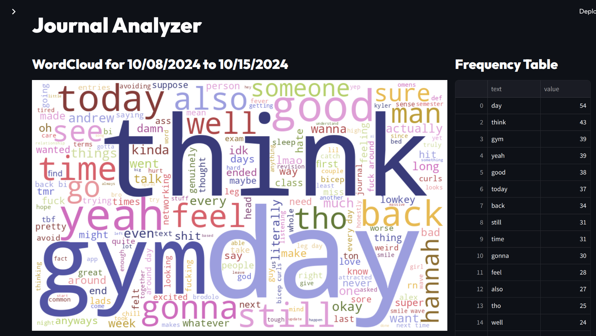

# Journal Analysis & NLP

### The project
I came up with this idea out of nowhere whilst doing my nightly journaling, and I got super excited to do it. Given that this semester has been an absolute hellhole, that sentiment to some extent is reflected in my journal entries, and so I thought it'd be interesting (or at least funny) to do some text analysis on my recent entries. And so here it is...my journal analyzer.
* Unfortunately there isn't a way to pull my entries programmatically from Apple Journal, so it's somewhat of a manual process to actually obtain the entries I want added to my dataset. I have to download those entries as PDFs and email them to myself, but from then on, everything else is done programmatically thanks to `pypdf`. 

### TODO
* This isn't intended to be a huge project; it's just something I thought would be fun and what I decided to do instead of revising for my networking exam that I failed. So really there aren't many next steps, but the main thing I want to address is to add stats for the entries over the selected time frame, e.g. average lexical diversity, min/max/average length of entries, total entries within the time frame, etc. Can also provide visualizations for this (small plotly ones, e.g. barplot for length of entry over the week)
  * Regardling lexical diversity, I do think I subconsciously may have made my vocabulary more diverse ever since I started analyzing my entries lol
* I'm thinking of removing some more stopwords, because I want my word cloud to highlight actually interesting words and not words like "least," "genuinely," "since," "around," etc. Maybe I should only keep nouns and verbs? Would require POS tagging tho I suppose?
* Yes, the code producing the web app is currently a mess. I promise I will fix it up in due time.
* Ideally I wanted the Word Cloud to be hoverable, but that isn't possible with the wordcloud package, and though it did work with the streamlit_wordcloud package, that caused the app to reload every time I hovered, which is way more annoying that sipmly not having the ability to hover. Perhaps still worth looking into tho. 
* If I truly wanted to nerd out, I can consider going deeper into the NLP rabbithole - go beyond simple word frequencies, and maybe look into sentiment analysis, emotion tagging, etc. Some suggestions: 
  * Sentiment analysis: quantifying the positivity/negativity of entries - any trends? Am I more positive/negative on certain days of the week?
  * Topic modelling: what are themes that I commonly talk about? How does this change over time?
  * Named entity recognition: not particularly sure what I can do with this just yet, but worth exploring
  * Part-of-speech tagging: more of a mundane, more raw-linguistics sort of task, but could help me look into the structure of my writing and if certain factors impact it
  * Collocations: determining common bigrams or trigrams - ultimately this would be nice to integrate into the word cloud
  * Emotion classification: similar to sentiment analysis